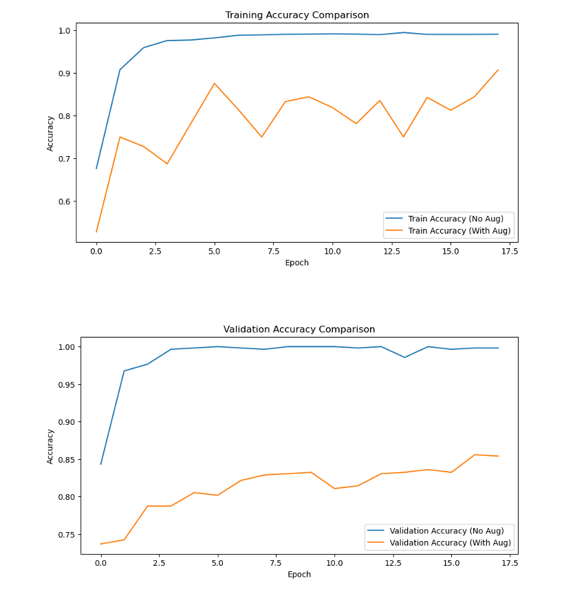
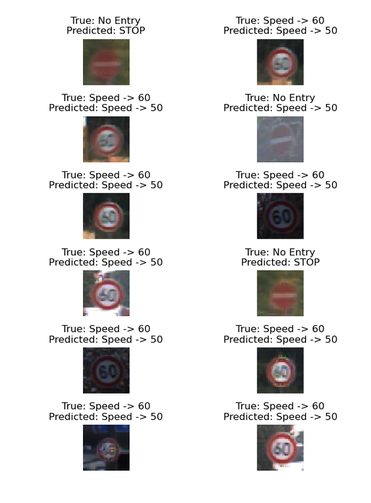
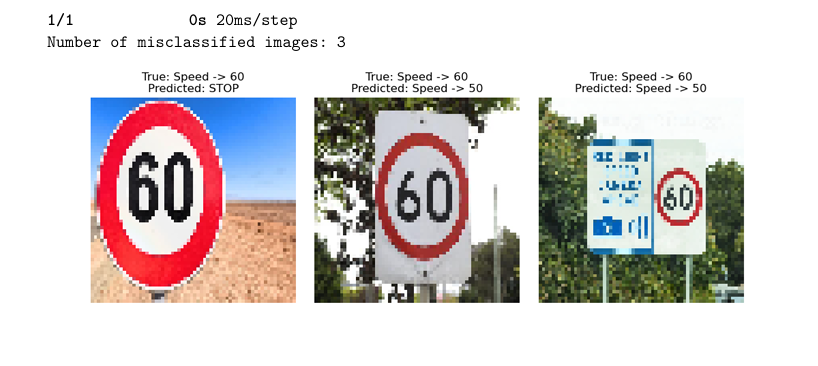

# 🚗 Deep Learning: Traffic Sign Classification for Autonomous Vehicles  

Welcome to my **Deep Learning Project**! This project focuses on building a robust traffic sign classification model for Australian road signs, enhancing autonomous vehicle safety through accurate and efficient identification of critical signs.  

## 🌟 Highlights  

- **🔍 Classification Task**: Identified key Australian road signs:
  - **Stop Signs**
  - **No Entry Signs**
  - **Speed Limit Signs** (e.g., 50 km/h, 60 km/h)  
- **📊 Dataset Utilization**: Leveraged the **GTSRB Dataset** with augmentation techniques for improved variability.  
- **🤖 Deep Learning**: Built a CNN-based architecture with regularization and dropout to minimize overfitting.  
- **🛠 Optimization**: Balanced model accuracy and inference speed for real-time applications in autonomous systems.  
- **📈 Generalization**: Addressed domain shifts by testing with real-world, unseen data.  

## 🛠️ Key Objectives  

1. Define a classification problem focusing on critical traffic signs.  
2. Build and train a Convolutional Neural Network (CNN) model to classify images into three categories.  
3. Incorporate **data augmentation** for enhanced model robustness.  
4. Evaluate and optimize the model using accuracy metrics and confusion matrices.  
5. Generalize the model for unseen datasets to simulate real-world scenarios.  

## 📚 The Dataset  

The project uses the [German Traffic Sign Recognition Benchmark (GTSRB)](https://drive.google.com/drive/folders/1cm1QRM_NUWcKkajQcgVe8qAUvnVqyJlb) dataset, filtered to include:  

- **Stop Signs**  
- **No Entry Signs**  
- **Speed Limit Signs (50 km/h, 60 km/h)** 

### Dataset Details:  
- **Training Set**: 70%  
- **Validation Set**: 10%  
- **Testing Set**: 20%  

**Enhancements**: Data augmentation was applied, including rotation, zoom, and brightness adjustments, to simulate diverse conditions like lighting and weather changes.  

## 🔬 Model Insights  

### Model Architecture:  
- **Layers**: Three convolutional layers with pooling, followed by dense and dropout layers.  
- **Regularization**: L2 regularization to reduce overfitting.  
- **Optimizer**: Adam optimizer for adaptive learning rates.  

### Results:  
- **Accuracy on Test Data**: Achieved **98.7%** accuracy without augmentation and **92.0%** with augmentation.  
- **Generalization Test**: Model performance validated on new, unseen datasets, with a focus on handling real-world variations effectively.  

### Key Challenges Addressed:  
- **Class Imbalance**: Balanced data through augmentation.  
- **Inter-class Similarity**: Enhanced feature extraction to differentiate visually similar signs.  
- **Real-time Performance**: Ensured low-latency classification suitable for autonomous systems.  

## 📈 Visualizations  

- **Training Progress**: Epoch-wise accuracy and loss plots.  
- **Confusion Matrix**: Detailed analysis of classification performance.  
- **Misclassified Samples**: Visualization of challenging cases and proposed solutions.  

## 📸 Screenshots  

Take a glimpse of the work:  

  
  
  

## 💡 Why This Matters  

This project demonstrates the integration of deep learning into autonomous vehicle technology, highlighting:  
- **🚦 Practical Applications**: Traffic sign recognition for safer autonomous navigation.  
- **🔍 Machine Learning Techniques**: Addressing real-world constraints like variability and domain shifts.  
- **🌍 Future Impacts**: Enhancing trust in autonomous systems through reliable performance.  

## 📁 Repository Contents  

- **Code**: Python scripts and Jupyter notebooks for data preprocessing, model training, and evaluation.  
- **Data**: Filtered dataset samples with metadata. [click](https://drive.google.com/drive/folders/1cm1QRM_NUWcKkajQcgVe8qAUvnVqyJlb)
- **Results**: Model performance metrics, visualizations, and insights.  

## 📬 Contact  

For queries or collaborations, feel free to reach out at [sathiyanarayanan.s1698@gmail.com](sathiyanarayanan.s1698@gmail.com).  

---

If you find this project interesting, please ⭐ star the repository and contribute your ideas! 🚀  

